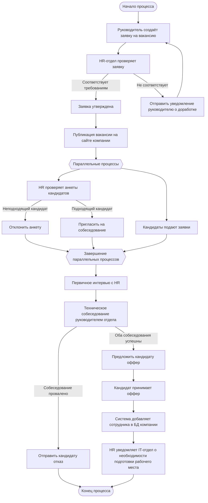

```mermaid

flowchart TD

%% ===== Начало =====
Start([Начало процесса])

%% ===== Подготовительный этап =====
Start --> A1[Руководитель создаёт заявку на вакансию]

A1 --> A2[HR-отдел проверяет заявку]

%% ---- Ветвление заявки ----
A2 -->|Соответствует требованиям| A3[Заявка утверждена]
A2 -->|Не соответствует| A2_1[Отправить уведомление руководителю о доработке]

A2_1 --> A1

%% ===== Этап отбора кандидатов =====
A3 --> B1[Публикация вакансии на сайте компании]

%% Параллельная структура
B1 --> B_PAR_START{{Параллельные процессы}}

%% --- кандидаты подают заявки ---
B_PAR_START --> B2[Кандидаты подают заявки]

%% --- HR проверяет анкеты ---
B_PAR_START --> B3[HR проверяет анкеты кандидатов]

%% ---- Ветвление анкет ----
B3 -->|Неподходящий кандидат| B3_1[Отклонить анкету]
B3_1 --> B_PAR_END

B3 -->|Подходящий кандидат| B3_2[Пригласить на собеседование]
B3_2 --> B_PAR_END

B2 --> B_PAR_END

B_PAR_END{{Завершение параллельных процессов}} --> C1[Первичное интервью с HR]

%% ===== Этап собеседований =====
C1 --> C2[Техническое собеседование руководителем отдела]

%% ---- Ветвление по результатам ----
C2 -->|Оба собеседования успешны| C3[Предложить кандидату оффер]
C2 -->|Собеседование провалено| C2_1[Отправить кандидату отказ]

C2_1 --> End([Конец процесса])

%% ===== Заключительный этап =====
C3 --> D1[Кандидат принимает оффер]

D1 --> D2[Система добавляет сотрудника в БД компании]

D2 --> D3[HR уведомляет IT-отдел о необходимости подготовки рабочего места]

D3 --> End([Конец процесса])
       
```
