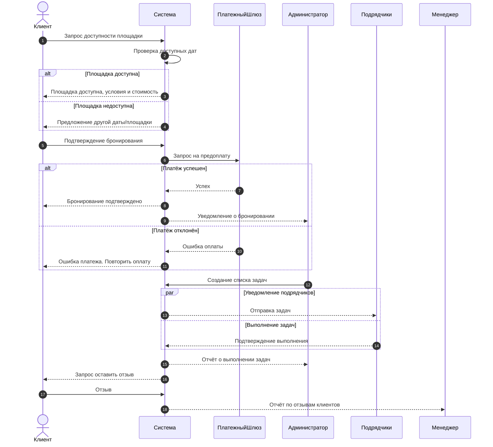

```mermaid
sequenceDiagram
    autonumber
    actor Клиент
    participant Система
    participant ПлатежныйШлюз
    participant Администратор
    participant Подрядчики
    participant Менеджер

    %% --- 1. Запрос на бронирование ---
    Клиент ->> Система: Запрос доступности площадки
    Система ->> Система: Проверка доступных дат

    alt Площадка доступна
        Система -->> Клиент: Площадка доступна, условия и стоимость
    else Площадка недоступна
        Система -->> Клиент: Предложение другой даты/площадки
    end

    %% --- 2. Подтверждение бронирования ---
    Клиент ->> Система: Подтверждение бронирования
    Система ->> ПлатежныйШлюз: Запрос на предоплату

    alt Платёж успешен
        ПлатежныйШлюз -->> Система: Успех
        Система -->> Клиент: Бронирование подтверждено
        Система -->> Администратор: Уведомление о бронировании
    else Платёж отклонён
        ПлатежныйШлюз -->> Система: Ошибка оплаты
        Система -->> Клиент: Ошибка платежа. Повторить оплату
    end

    %% --- 3. Организация мероприятия ---
    Администратор ->> Система: Создание списка задач

    par Уведомление подрядчиков
        Система -->> Подрядчики: Отправка задач
    and Выполнение задач
        Подрядчики -->> Система: Подтверждение выполнения
    end

    Система -->> Администратор: Отчёт о выполнении задач

    %% --- 4. Завершение мероприятия ---
    Система -->> Клиент: Запрос оставить отзыв
    Клиент ->> Система: Отзыв
    Система -->> Менеджер: Отчёт по отзывам клиентов

```
